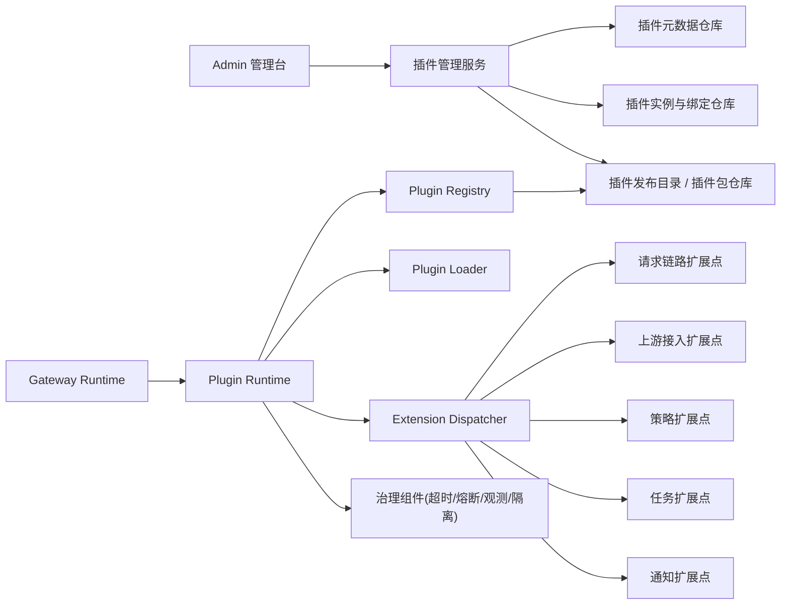

# 插件体系总体设计

## 1. 背景

当前项目中已经存在一些“可插拔雏形”，例如：

- 上游供应商适配器 `UpstreamProviderAdapter`
- 协议执行器 `UpstreamProtocolExecutor`
- Usage 解析器 `UsageExtractor`
- 定时任务处理器 `ScheduledTaskHandler`

这些接口方向是对的，但没有形成统一的插件体系。另一方面，现有“插件管理”只有元数据管理能力，缺少运行时装载、绑定、执行、治理和可观测能力。

如果以新项目视角重建，建议不沿用现有 `PRE/POST` 类型设计，也不把“插件”理解成一个简单开关，而是重建为：

- 插件内核模型
- 插件扩展点模型
- 插件装载与执行运行时
- 插件实例与绑定管理
- 插件治理与观测体系

## 2. 设计目标

1. 支持以统一方式扩展网关核心链路
2. 支持按作用域绑定插件
3. 支持内置插件和外部插件包两种来源
4. 支持有序执行、超时控制、失败策略、熔断和观测
5. 支持插件配置版本化和灰度发布

## 3. 非目标

以下能力不建议插件化：

- 核心认证模型
- 核心计费台账主流程
- 路由规则与配置的持久化核心逻辑
- 基础错误码与统一响应模型
- 数据库事务基础设施

这些能力应保留在内核中，只向插件暴露有限的扩展点。

## 4. 核心概念

### 4.1 插件包

插件包是一个可分发单元，包含：

- 插件元数据
- 能力声明
- 入口类
- 配置定义
- 版本信息
- 校验信息

### 4.2 插件实例

插件实例是插件包在某个环境中的启用实体，包含：

- 当前状态
- 实例级配置
- 绑定范围
- 顺序
- 灰度策略

### 4.3 扩展点

扩展点是内核在运行时开放的挂载点，每个挂载点定义：

- 输入上下文
- 输出约束
- 是否可中断链路
- 是否允许改写请求/响应
- 是否要求幂等

### 4.4 作用域

插件不能只做“全局启用/禁用”，必须支持按作用域绑定：

- 全局
- 应用
- 消费者
- 路由规则
- 供应商
- 模型
- 模型池

## 5. 推荐总体架构

## 6. 推荐实施路径

### 阶段一：内置插件体系

先不做外部 jar 装载，只用 Spring Bean 作为插件来源，统一：

- 插件接口
- 扩展点注册
- 实例配置
- 绑定关系
- 执行治理

这一步可以快速把架构立住。

### 阶段二：外部插件包

支持从 `plugins/` 目录装载插件包，新增：

- 插件 manifest
- 独立类加载器
- 插件来源区分
- 插件包版本管理

### 阶段三：灰度与治理

补齐：

- 灰度放量
- 插件熔断
- 插件 SLA 指标
- 插件审计日志

## 7. 新项目下对现有实现的处理建议

### 建议保留的设计思路

- `UpstreamProviderAdapter`
- `UpstreamProtocolExecutor`
- `UsageExtractor`
- `ScheduledTaskHandler`

这些都可以演化为插件 SPI 的一部分。

### 建议重建的部分

- 当前 `plugins` 表和插件管理页面
- 当前 `plugin_type=PRE/POST` 模型
- 当前“只管元数据，不接运行时”的实现

结论：现有插件功能建议推倒重建。
