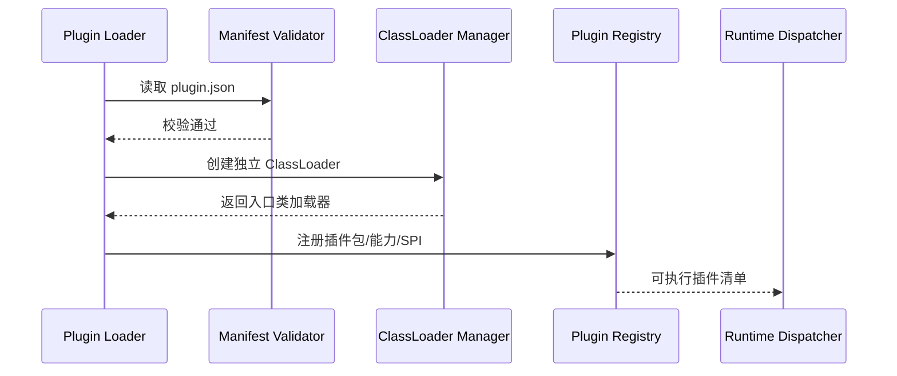

# 插件装载与运行时设计

## 1. 总体策略

推荐两层插件来源：

1. 内置插件
2. 外部插件包

## 2. 内置插件

内置插件本质是 Spring Bean。

优点：

- 实现成本低
- 便于快速启动
- 易于调试

适用阶段：

- 项目早期
- 官方内建能力
- 核心链路先验证插件架构

## 3. 外部插件包

外部插件包建议使用独立 jar + manifest 模式。

目录示例：

```text
plugins/
  content-filter/
    plugin.json
    content-filter-1.0.0.jar
  route-score/
    plugin.json
    route-score-1.2.0.jar
```

## 4. 装载流程



## 5. ClassLoader 策略

建议每个插件包一个独立 ClassLoader。

理由：

- 避免依赖冲突
- 支持同名不同版本插件并存
- 方便插件卸载和升级

建议采取：

- Parent-first 加载内核 SPI
- Child-first 加载插件自身依赖

## 6. 运行时调度器

需要单独的 `PluginDispatcher`，职责包括：

- 根据扩展点加载插件实例
- 根据作用域筛选启用实例
- 按顺序执行
- 做超时、熔断、失败策略处理

执行伪代码：

```java
for (PluginInstance instance : instances) {
    if (!matcher.matches(instance, context)) {
        continue;
    }
    if (circuitBreaker.isOpen(instance)) {
        continue;
    }
    try {
        PluginResult result = timeoutGuard.execute(instance, () -> plugin.apply(context));
        metrics.record(instance, result);
        if (result.blocksFlow()) {
            return result;
        }
    } catch (Exception ex) {
        governance.handle(instance, ex);
    }
}
```

## 7. 失败策略

每个插件实例必须配置失败策略：

- `FAIL_OPEN`
  - 插件失败时放行主链路
- `FAIL_CLOSE`
  - 插件失败时阻断主链路

建议默认：

- 审计、埋点、通知类：`FAIL_OPEN`
- 安全、合规、风控类：`FAIL_CLOSE`

## 8. 熔断与超时

插件必须有独立治理参数：

- `timeout_ms`
- `error_rate_threshold`
- `slow_call_threshold`
- `open_duration_ms`

## 9. 热加载建议

不建议第一版做真正热加载。

第一版建议：

- 插件包上传后写入元数据
- 标记待生效
- 由网关实例重启或滚动发布后生效

等基础治理成熟后，再考虑热更新。
