# 开发落地手册（模块详细设计）

本文为“可直接开发”版本，按模块提供：类图、时序图、API 示例、字段字典、状态机定义。

## 1. 系统管理

### 类图
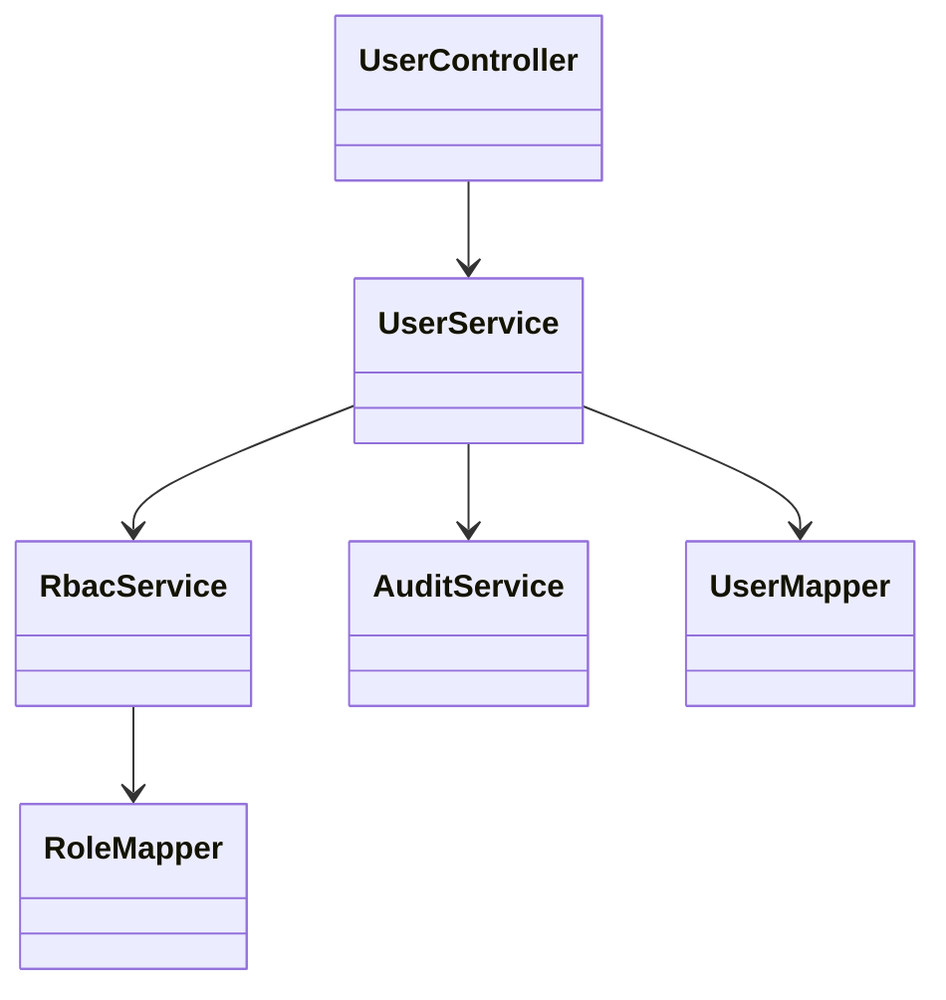
```mermaid
classDiagram
class UserController
class UserService
class RbacService
class AuditService
class UserMapper
class RoleMapper
UserController --> UserService
UserService --> UserMapper
UserService --> RbacService
UserService --> AuditService
RbacService --> RoleMapper
```

### 时序图
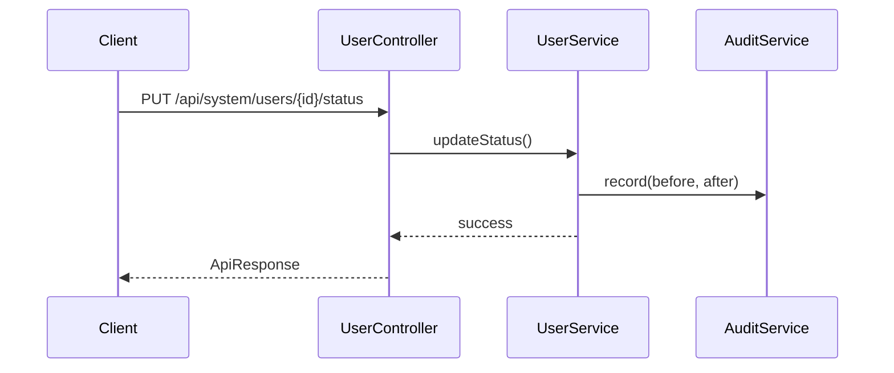
```mermaid
sequenceDiagram
participant C as Client
participant UC as UserController
participant US as UserService
participant AS as AuditService
C->>UC: PUT /api/system/users/{id}/status
UC->>US: updateStatus()
US->>AS: record(before, after)
US-->>UC: success
UC-->>C: ApiResponse
```

### API 示例
- 请求：`PUT /api/system/users/1001/status`
```json
{"status":"LOCKED","reason":"risk_control"}
```
- 响应：
```json
{"success":true,"message":"ok","data":{"id":1001,"status":"LOCKED"}}
```

### 字段字典（users）
- `id`：用户主键，BIGINT
- `tenant_id`：租户ID
- `username`：账号，唯一
- `status`：`ENABLED/LOCKED/DISABLED`
- `created_at/updated_at`：审计时间

### 状态机
- 用户：`ENABLED -> LOCKED -> ENABLED`
- 用户：`ENABLED -> DISABLED`

## 2. 供应商管理

### 类图
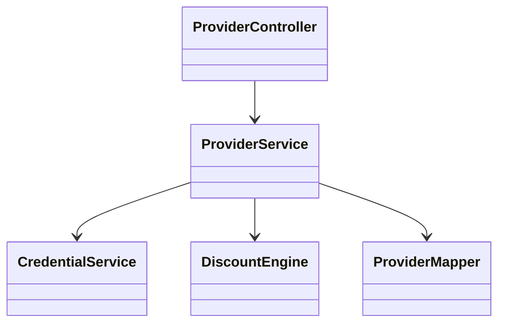
```mermaid
classDiagram
class ProviderController
class ProviderService
class CredentialService
class DiscountEngine
class ProviderMapper
ProviderController --> ProviderService
ProviderService --> CredentialService
ProviderService --> DiscountEngine
ProviderService --> ProviderMapper
```

### 时序图
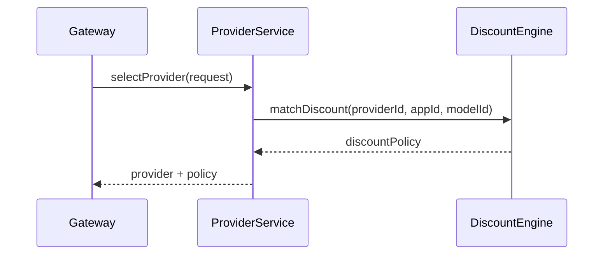
```mermaid
sequenceDiagram
participant G as Gateway
participant PS as ProviderService
participant DE as DiscountEngine
G->>PS: selectProvider(request)
PS->>DE: matchDiscount(providerId, appId, modelId)
DE-->>PS: discountPolicy
PS-->>G: provider + policy
```

### API 示例
- 请求：`POST /api/providers/1/discount-policies`
```json
{"policyName":"q2_discount","scopeType":"APP","scopeRefId":2001,"discountType":"RATE","discountValue":0.85}
```
- 响应：
```json
{"success":true,"message":"ok","data":{"id":10,"status":"ACTIVE"}}
```

### 字段字典（provider_discount_policies）
- `policy_name`：策略名称
- `scope_type`：`GLOBAL/APP/MODEL`
- `discount_type`：`RATE/FIXED/LADDER`
- `discount_value`：折扣值
- `effective_from/effective_to`：生效区间

### 状态机
- 供应商：`DRAFT -> ENABLED -> DISABLED -> ARCHIVED`
- 折扣策略：`DRAFT -> ACTIVE -> EXPIRED`

## 3. 模型管理

### 类图
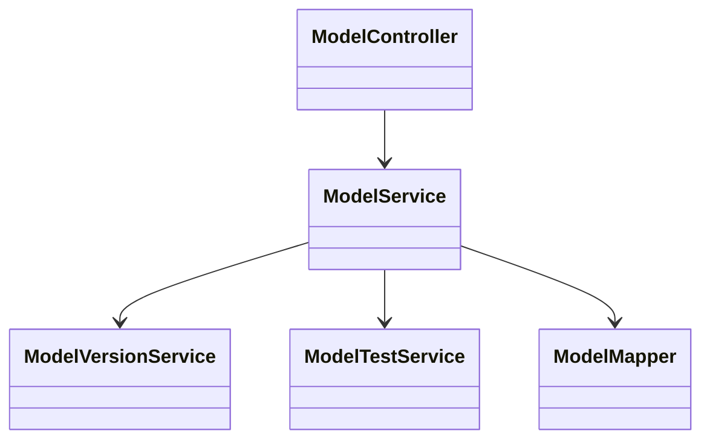
```mermaid
classDiagram
class ModelController
class ModelService
class ModelVersionService
class ModelTestService
class ModelMapper
ModelController --> ModelService
ModelService --> ModelVersionService
ModelService --> ModelTestService
ModelService --> ModelMapper
```

### 时序图
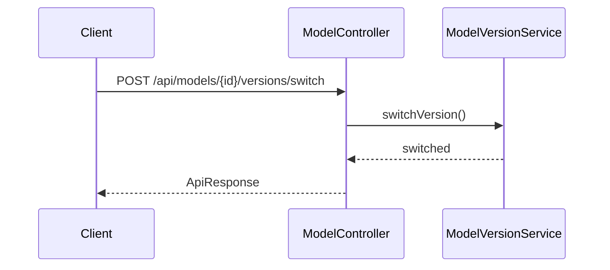
```mermaid
sequenceDiagram
participant C as Client
participant MC as ModelController
participant MVS as ModelVersionService
C->>MC: POST /api/models/{id}/versions/switch
MC->>MVS: switchVersion()
MVS-->>MC: switched
MC-->>C: ApiResponse
```

### API 示例
```json
// POST /api/models/11/test
{"prompt":"hello","temperature":0.7,"maxTokens":128}
```
```json
{"success":true,"data":{"output":"hi","latencyMs":430,"tokenUsage":86}}
```

### 字段字典（models）
- `model_code`：模型编码，唯一
- `provider_id`：所属供应商
- `model_type`：`CHAT/EMBEDDING/GENERATION`
- `status`：`ENABLED/DISABLED`

### 状态机
- 模型版本：`DRAFT -> GRAY -> ACTIVE -> ROLLED_BACK`

## 4. 应用管理

### 类图
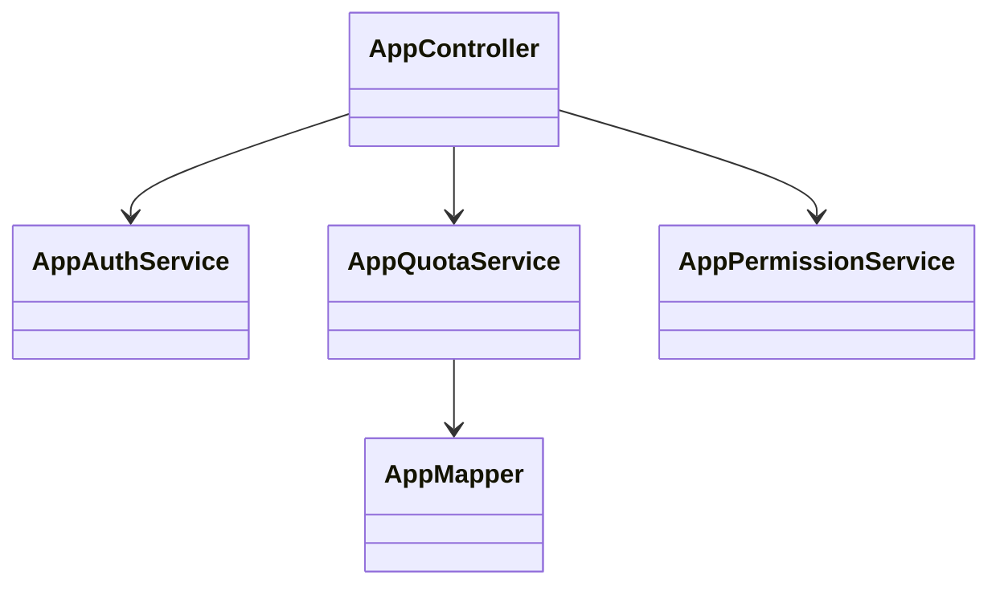
```mermaid
classDiagram
class AppController
class AppAuthService
class AppQuotaService
class AppPermissionService
class AppMapper
AppController --> AppAuthService
AppController --> AppQuotaService
AppController --> AppPermissionService
AppQuotaService --> AppMapper
```

### 时序图
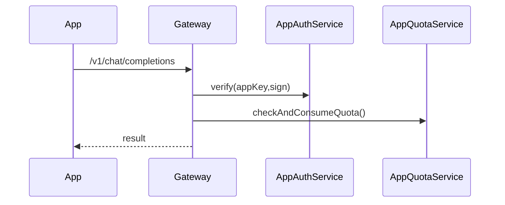
```mermaid
sequenceDiagram
participant A as App
participant GW as Gateway
participant AAS as AppAuthService
participant AQS as AppQuotaService
A->>GW: /v1/chat/completions
GW->>AAS: verify(appKey,sign)
GW->>AQS: checkAndConsumeQuota()
GW-->>A: result
```

### API 示例
```json
// PUT /api/apps/101/quota
{"dailyLimit":100000,"monthlyLimit":2000000,"tokenLimit":50000000}
```
```json
{"success":true,"data":{"appId":"app_order_center","quotaStatus":"UPDATED"}}
```

### 字段字典（apps）
- `app_id`：业务应用ID，唯一
- `ip_whitelist_json`：IP白名单
- `rate_limit_json`：限流策略
- `quota_json`：额度策略

### 状态机
- 应用：`ENABLED -> DISABLED -> ENABLED`

## 5. 模型路由规则

### 类图
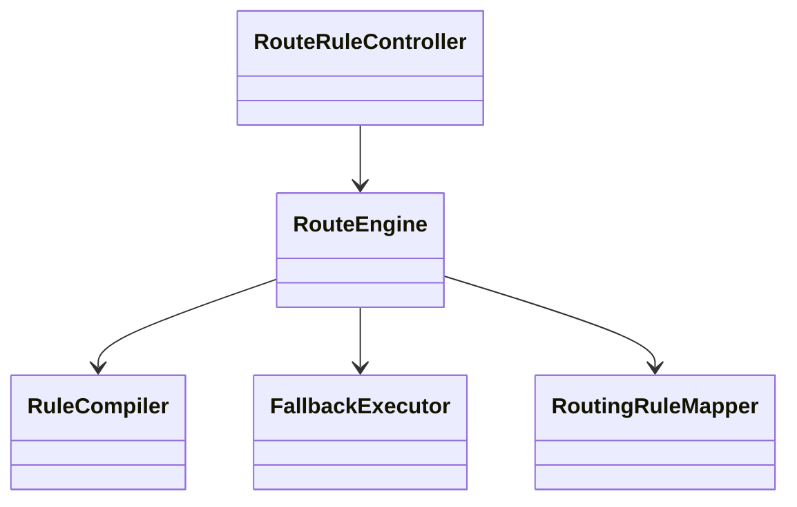
```mermaid
classDiagram
class RouteRuleController
class RouteEngine
class RuleCompiler
class FallbackExecutor
class RoutingRuleMapper
RouteRuleController --> RouteEngine
RouteEngine --> RuleCompiler
RouteEngine --> FallbackExecutor
RouteEngine --> RoutingRuleMapper
```

### 时序图
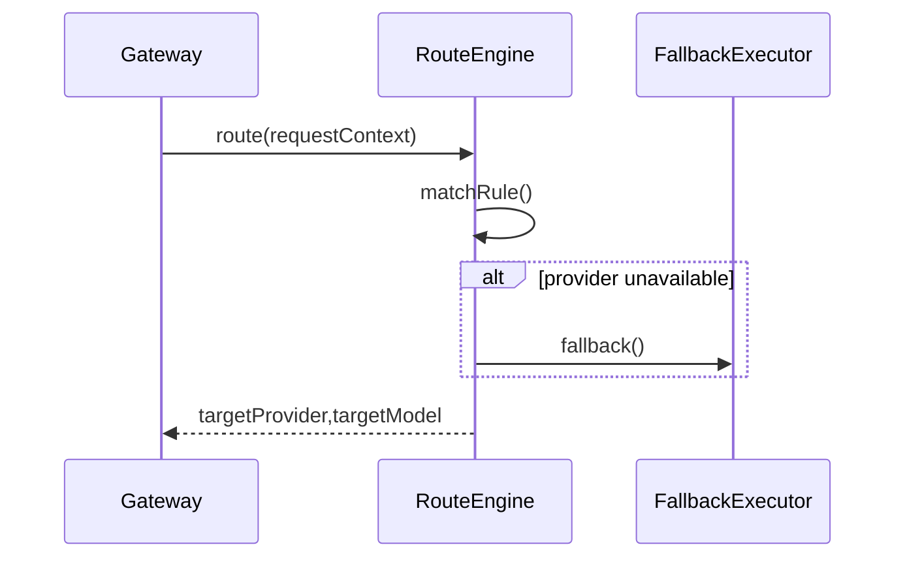
```mermaid
sequenceDiagram
participant GW as Gateway
participant RE as RouteEngine
participant FE as FallbackExecutor
GW->>RE: route(requestContext)
RE->>RE: matchRule()
alt provider unavailable
RE->>FE: fallback()
end
RE-->>GW: targetProvider,targetModel
```

### API 示例
```json
// POST /api/routing-rules/8/test
{"appId":"app_cs","tags":["low_cost"],"time":"20:15:00"}
```
```json
{"success":true,"data":{"matchedRuleId":8,"targetProviderId":2,"targetModelId":15}}
```

### 字段字典（routing_rules）
- `strategy_type`：`FIXED/WEIGHTED/FAILOVER/COST_FIRST`
- `priority`：优先级（越小越高）
- `condition_expr`：规则表达式
- `status`：`ENABLED/DISABLED`

### 状态机
- 规则：`DRAFT -> ENABLED -> DISABLED -> ARCHIVED`

## 6. 计费规则及成本统计

### 类图
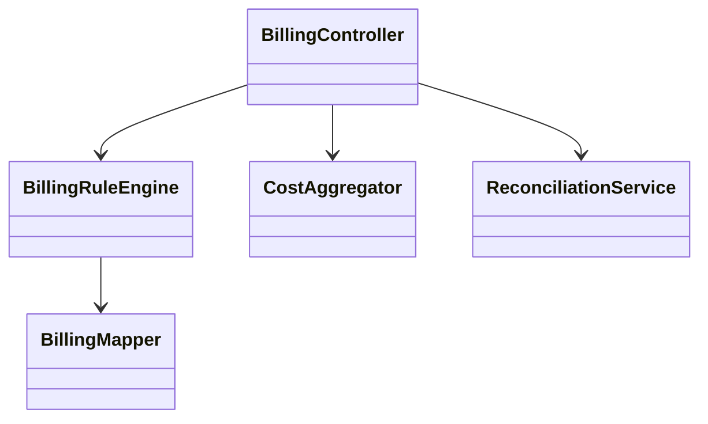
```mermaid
classDiagram
class BillingController
class BillingRuleEngine
class CostAggregator
class ReconciliationService
class BillingMapper
BillingController --> BillingRuleEngine
BillingController --> CostAggregator
BillingController --> ReconciliationService
BillingRuleEngine --> BillingMapper
```

### 时序图
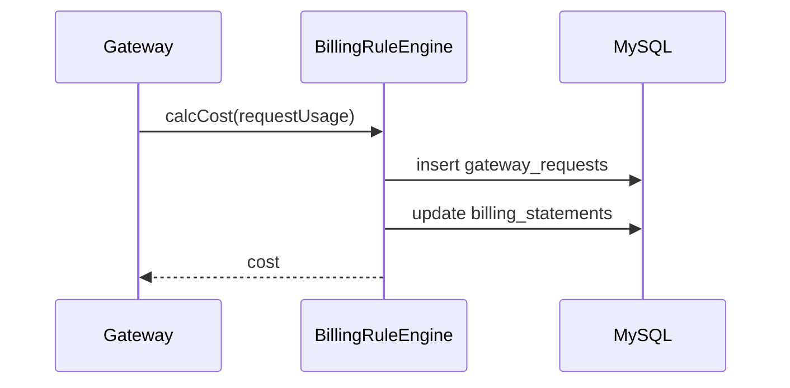
```mermaid
sequenceDiagram
participant GW as Gateway
participant BRE as BillingRuleEngine
participant DB as MySQL
GW->>BRE: calcCost(requestUsage)
BRE->>DB: insert gateway_requests
BRE->>DB: update billing_statements
BRE-->>GW: cost
```

### API 示例
```json
// GET /api/billing/summary?from=2026-04-01&to=2026-04-30
{"success":true,"data":{"requestCount":200300,"tokenUsage":9860000,"totalCost":12340.56}}
```

### 字段字典（gateway_requests）
- `request_id`：请求唯一ID
- `input_tokens/output_tokens/total_tokens`：token消耗
- `cost_amount`：费用
- `billing_rule_id`：命中规则

### 状态机
- 账单：`GENERATED -> RECONCILING -> CONFIRMED -> CLOSED`

## 7. 安全与监控管理

### 类图
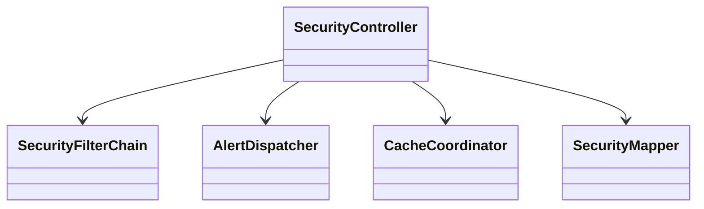
```mermaid
classDiagram
class SecurityController
class SecurityFilterChain
class AlertDispatcher
class CacheCoordinator
class SecurityMapper
SecurityController --> SecurityFilterChain
SecurityController --> AlertDispatcher
SecurityController --> CacheCoordinator
SecurityController --> SecurityMapper
```

### 时序图
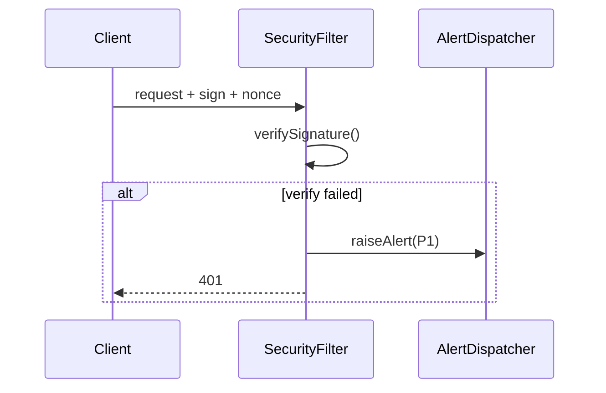
```mermaid
sequenceDiagram
participant C as Client
participant SF as SecurityFilter
participant AD as AlertDispatcher
C->>SF: request + sign + nonce
SF->>SF: verifySignature()
alt verify failed
SF->>AD: raiseAlert(P1)
SF-->>C: 401
end
```

### API 示例
```json
// PUT /api/security/policies
{"policyCode":"ANTI_REPLAY","config":{"nonceTtlSec":300,"clockSkewSec":60}}
```
```json
{"success":true,"data":{"policyCode":"ANTI_REPLAY","status":"ENABLED"}}
```

### 字段字典（alerts）
- `alert_type`：告警类型
- `level`：`P1/P2/P3`
- `status`：`OPEN/ACK/RESOLVED/CLOSED`
- `biz_type/biz_id`：关联业务对象

### 状态机
- 告警：`OPEN -> ACK -> RESOLVED -> CLOSED`

## 8. 插件管理

### 类图
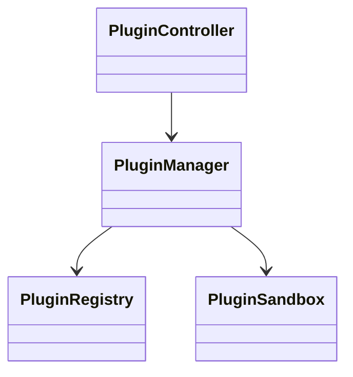
```mermaid
classDiagram
class PluginController
class PluginManager
class PluginRegistry
class PluginSandbox
PluginController --> PluginManager
PluginManager --> PluginRegistry
PluginManager --> PluginSandbox
```

### 时序图
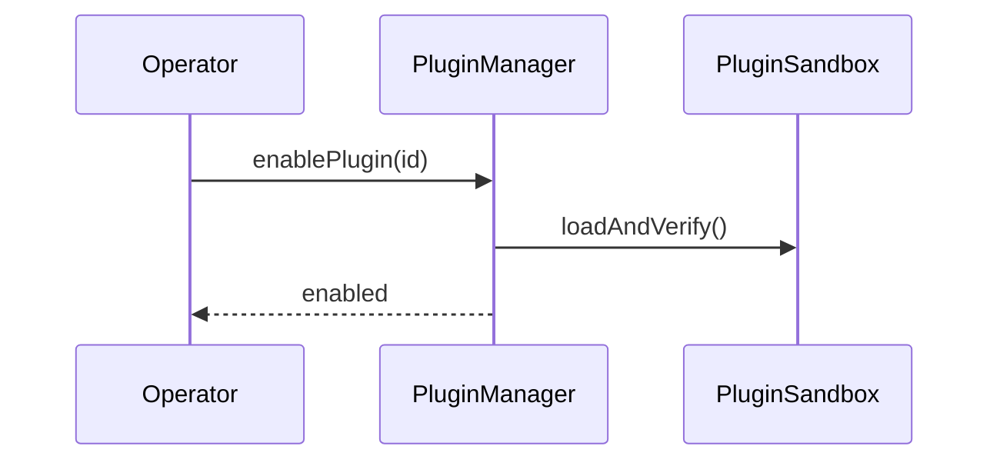
```mermaid
sequenceDiagram
participant O as Operator
participant PM as PluginManager
participant PS as PluginSandbox
O->>PM: enablePlugin(id)
PM->>PS: loadAndVerify()
PM-->>O: enabled
```

### API 示例
```json
// PUT /api/plugins/9/status
{"status":"ENABLED","grayPercent":20}
```

### 字段字典（plugins）
- `code`：插件编码
- `plugin_type`：`PRE/POST/AUDIT`
- `version`：版本号
- `status`：`DISABLED/ENABLED`

### 状态机
- 插件：`INSTALLED -> DISABLED -> ENABLED -> UPGRADED -> DISABLED`

## 9. 灰度发布

### 类图
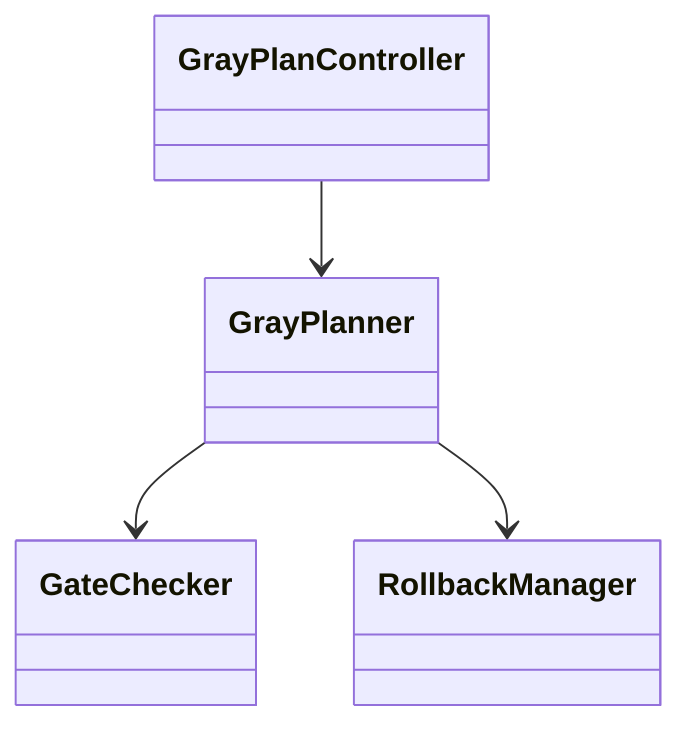
```mermaid
classDiagram
class GrayPlanController
class GrayPlanner
class GateChecker
class RollbackManager
GrayPlanController --> GrayPlanner
GrayPlanner --> GateChecker
GrayPlanner --> RollbackManager
```

### 时序图
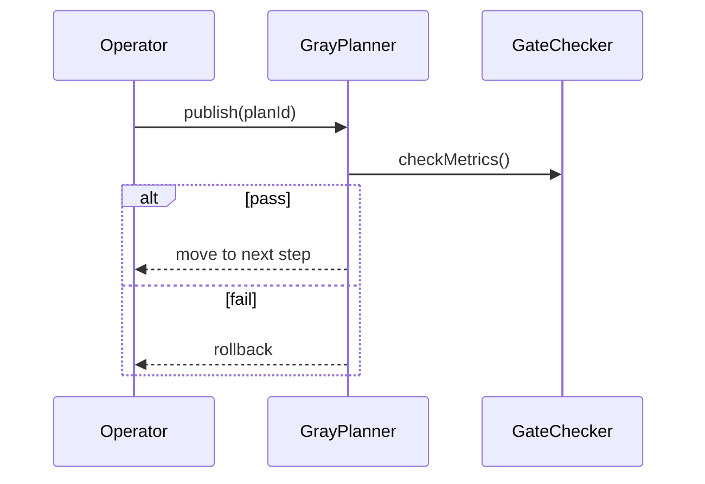
```mermaid
sequenceDiagram
participant OP as Operator
participant GP as GrayPlanner
participant GC as GateChecker
OP->>GP: publish(planId)
GP->>GC: checkMetrics()
alt pass
GP-->>OP: move to next step
else fail
GP-->>OP: rollback
end
```

### API 示例
```json
// POST /api/release/gray-plans
{"targetType":"ROUTING_RULE","targetId":8,"steps":[10,30,50,100]}
```

### 字段字典（gray_plans）
- `target_type`：灰度对象类型
- `traffic_percent`：当前流量比例
- `status`：`DRAFT/RUNNING/ROLLED_BACK/FINISHED`

### 状态机
- 灰度计划：`DRAFT -> APPROVED -> RUNNING -> FINISHED`
- 异常：`RUNNING -> ROLLED_BACK`

## 10. API文档管理

### 类图
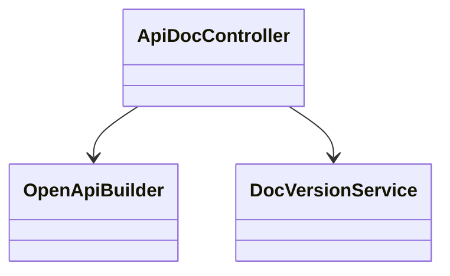
```mermaid
classDiagram
class ApiDocController
class OpenApiBuilder
class DocVersionService
ApiDocController --> OpenApiBuilder
ApiDocController --> DocVersionService
```

### 时序图
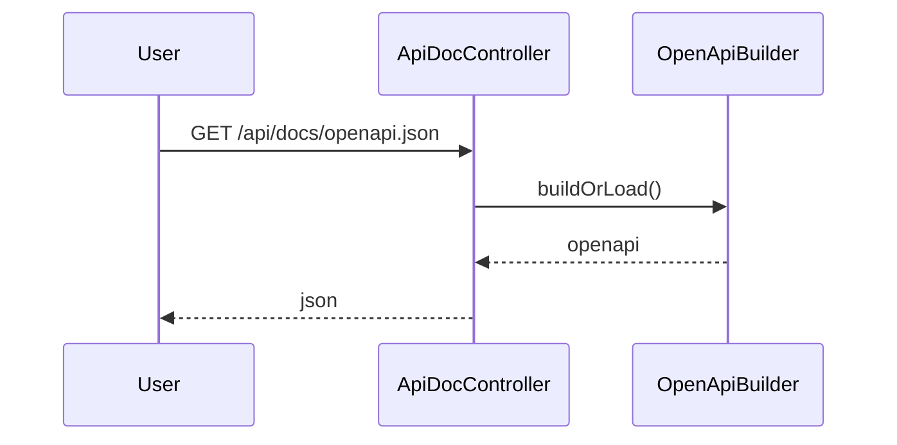
```mermaid
sequenceDiagram
participant U as User
participant ADC as ApiDocController
participant OAB as OpenApiBuilder
U->>ADC: GET /api/docs/openapi.json
ADC->>OAB: buildOrLoad()
OAB-->>ADC: openapi
ADC-->>U: json
```

### API 示例
```json
// GET /api/docs/changelog
{"success":true,"data":[{"version":"v1.3.0","changes":["add routing test api"]}]}
```

### 字段字典（api_docs_versions，建议）
- `version`：文档版本
- `openapi_json`：快照内容
- `published_at`：发布时间

### 状态机
- 文档版本：`DRAFT -> PUBLISHED -> DEPRECATED`

## 11. 通知管理

### 类图
```mermaid
classDiagram
class NotificationController
class TemplateEngine
class ChannelAdapter
class NotifyScheduler
NotificationController --> TemplateEngine
NotificationController --> ChannelAdapter
NotificationController --> NotifyScheduler
```

### 时序图
```mermaid
sequenceDiagram
participant A as AlertService
participant NS as NotifyScheduler
participant CA as ChannelAdapter
A->>NS: send(alertEvent)
NS->>CA: sendByPolicy()
CA-->>NS: receipt
NS-->>A: done
```

### API 示例
```json
// POST /api/notifications/send
{"templateCode":"quota_warning","receivers":["ops@knot.com"],"vars":{"appId":"app_order","remain":"8%"}}
```
```json
{"success":true,"data":{"taskId":"ntf_20260421_001","status":"SENT"}}
```

### 字段字典（notification_records）
- `template_id`：模板ID
- `receiver`：接收者
- `channel`：`EMAIL/SMS/WEBHOOK`
- `send_status`：`PENDING/SENT/FAILED`

### 状态机
- 通知任务：`PENDING -> SENT`
- 失败重试：`FAILED -> RETRYING -> SENT/FAILED`

## 12. PRD对齐补充项（本次检查新增）

以下内容为对照 `docs/prd` 后补充的缺口，建议纳入开发基线。

### 12.1 系统管理补充
- 组织归属补充：支持“一个用户归属多个部门”，新增 `user_departments(user_id, dept_id, is_primary)`。
- 运维落库补充：新增 `gateway_nodes`、`system_configs`、`backup_jobs`、`backup_records`、`release_versions`。
- 接口补充：
  - `POST /api/system/backups`
  - `POST /api/system/backups/{id}/restore`
  - `GET /api/system/nodes`

### 12.2 供应商管理补充
- 认证补充：OAuth2 凭证模型增加 `token_endpoint`、`client_id`、`scope`、`refresh_token` 字段。
- 批量轮换补充：新增凭证批量更新任务 `provider_credential_rotate_jobs`。
- 对账补充：供应商侧账单导入能力（`provider_bills`）与自动差异比对任务。

### 12.3 模型管理补充
- 模型分组补充：新增 `model_groups` 与 `model_group_rel`，对应 PRD“场景分组”能力。
- 性能对比补充：新增 `model_benchmark_records`，记录同 prompt 多模型对比结果。

### 12.4 应用管理补充
- 主子应用额度补充：支持主应用共享池 + 子应用分配额度，新增 `app_quota_pools`、`app_quota_allocations`。
- IP 白名单补充：支持 CIDR 段匹配与变更灰度生效。

### 12.5 路由规则补充
- 规则测试补充：路由模拟结果落表 `routing_rule_test_records`，保留输入上下文与命中轨迹。
- 可解释性补充：命中日志增加 `rule_version` 与 `match_snapshot_json`。

### 12.6 计费与成本补充
- 计费模式补充：固定价、阶梯价、套餐价分别定义计算函数与优先级。
- 对账闭环补充：新增 `reconciliation_tasks`、`reconciliation_diffs`、`reconciliation_actions`。
- 导出补充：账单导出支持 Excel/PDF，两者均记录导出审计日志。

### 12.7 安全与监控补充
- 防重放补充：nonce 存储采用 Redis（`nonce:{appId}:{nonce}`），TTL 默认 300 秒。
- 缓存一致性补充：模型/路由/折扣变更后发布失效事件 `CACHE_INVALIDATE_EVENT`。
- 频控联动补充：频控高频触发时自动降低权重路由中的高成本模型比例。

### 12.8 可选模块补充
- 插件管理：增加插件签名校验与沙箱资源限额（CPU/内存/超时）。
- 灰度发布：门禁检查失败自动生成回滚工单与通知。
- API文档：错误码字典、限流说明、鉴权示例作为文档必填章节。
- 通知管理：告警去重键规则标准化（`eventType + bizKey + level + window`）。

## 13. PRD对齐补充（本批次第1轮）

### 13.1 数据一致性与事务边界
- 网关主流程采用“本地事务 + 事件最终一致”模式：
  - 同事务写入：`gateway_requests`、`provider_discount_snapshots`（若命中）、审计主记录；
  - 事务后异步：监控聚合、告警分发、统计看板刷新。
- 关键一致性约束：
  - 请求计费记录与账单聚合必须可追溯到 `request_id`；
  - 折扣快照必须与计费记录在同一请求上下文共享 `trace_id`。

### 13.2 幂等与防重
- 写接口幂等窗口默认 24 小时，幂等键冲突返回固定语义。
- 异步任务去重键：
  - 对账任务：`biz_date + provider_id + statement_type`
  - 聚合任务：`metric_type + time_bucket + biz_id`

### 13.3 缺失表补充（建议）
- `idempotency_records`
- `provider_bills`
- `provider_credential_rotate_jobs`
- `routing_rule_test_records`
- `app_quota_pools`、`app_quota_allocations`

### 13.4 验收门槛
- 幂等重复请求不产生重复写入；
- 对账任务重复触发只保留一条有效任务；
- 关键链路失败可重试且不重复计费。

## 14. PRD对齐补充（本批次第2轮）

### 14.1 频控与额度联动细化
- 执行顺序固定：应用 -> 模型 -> 供应商。
- 联动策略：
  - 应用层超限：直接拒绝并返回可恢复时间；
  - 模型层超限：触发备用模型路由；
  - 供应商层超限：触发备用供应商或降级响应。
- 时段规则冲突处理：
  - 命中多个时段时按“最小窗口优先”；
  - 无命中时回退默认阈值。

### 14.2 监控指标字典补充
- 核心指标（必须）：
  - `gw_request_qps`
  - `gw_request_latency_p95`
  - `gw_error_rate`
  - `gw_rate_limit_trigger_count`
  - `gw_quota_remaining_ratio`
  - `gw_cache_hit_ratio`
- 指标统一标签：
  - `tenant_id`、`app_id`、`provider_id`、`model_id`、`env`。

### 14.3 告警收敛策略
- 去重窗口默认 5 分钟；
- 升级策略：P2 未处理 10 分钟升级 P1；
- 恢复策略：连续 N 个窗口恢复后自动关闭（默认 N=3）。

### 14.4 验收门槛
- 频控触发场景具备可解释的命中日志；
- 告警无风暴（重复告警量下降可量化）。

## 15. PRD对齐补充（本批次第3轮）

### 15.1 安全设计补充
- 签名协议建议：
  - 签名串包含 `method + path + timestamp + nonce + bodyHash`；
  - 默认 `HMAC-SHA256`，时钟偏移容忍 60 秒。
- 敏感字段治理：
  - 配置中心定义敏感字段字典；
  - 日志落盘前统一脱敏过滤器处理。
- 后台安全：
  - 管理端强制 MFA（可选）；
  - 高风险操作二次确认（如密钥重置、批量禁用）。

### 15.2 审计合规补充
- 审计日志不可改写，仅可归档；
- 导出审计日志必须记录审批单号与导出目的；
- 审计查询支持“按对象ID追踪全生命周期”。

### 15.3 漏洞与依赖治理
- 依赖扫描纳入 CI；
- P1/P2 漏洞为上线阻断项。

### 15.4 验收门槛
- 重放攻击测试必须拦截成功；
- 审计抽查能还原关键操作前后快照。

## 16. PRD对齐补充（本批次第4轮）

### 16.1 灰度与回滚工程化
- 灰度步骤模板：
  - 10% -> 30% -> 50% -> 100%，每阶段观察 15 分钟；
  - 每阶段门禁：错误率、P95、P1告警、业务成功率。
- 自动回滚触发：
  - 错误率超阈值持续 3 个采样周期；
  - 或关键业务指标跌破基线下限。
- 回滚后动作：
  - 自动生成事件报告；
  - 通知责任人与值班群；
  - 锁定继续发布入口待人工确认。

### 16.2 容灾演练补充
- 演练场景：
  - 主供应商不可用；
  - Redis 不可用；
  - 主库只读或连接耗尽。
- 演练记录：
  - 计划、执行、结果、改进项闭环。

### 16.3 验收门槛
- 回滚动作在 5 分钟内完成；
- 演练报告每季度至少一版。

## 17. PRD对齐补充（本批次第5轮，研发执行清单化）

### 17.1 模块交付清单模板
- 每个模块至少交付：
  - Controller 接口 + DTO 校验
  - Service 业务实现 + 事务边界
  - Mapper/SQL + 索引说明
  - 单测/集成测试
  - 监控指标与告警规则
  - 审计埋点

### 17.2 开发完成定义（DoD）
- 功能通过：核心流程 + 异常流程；
- 数据通过：字段完整、索引命中；
- 安全通过：鉴权、签名、脱敏；
- 运维通过：监控、告警、日志、回滚；
- 文档通过：API 示例、错误码、变更记录。

### 17.3 里程碑建议
- M1（基础治理）：多租户、审计、幂等、错误码；
- M2（核心闭环）：路由、频控额度联动、计费对账；
- M3（稳定性）：灰度回滚、容灾演练、告警闭环；
- M4（增强能力）：插件、通知、文档治理。
